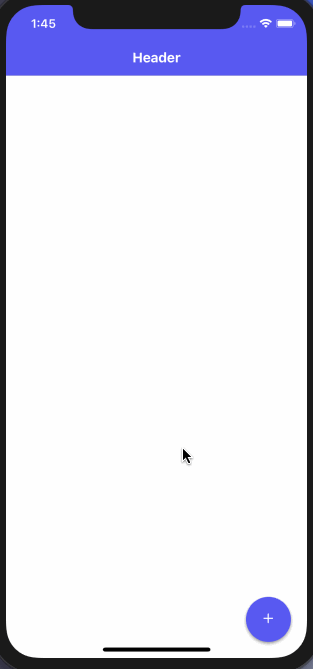
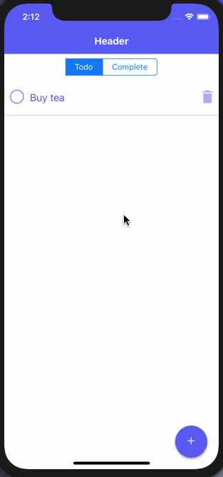
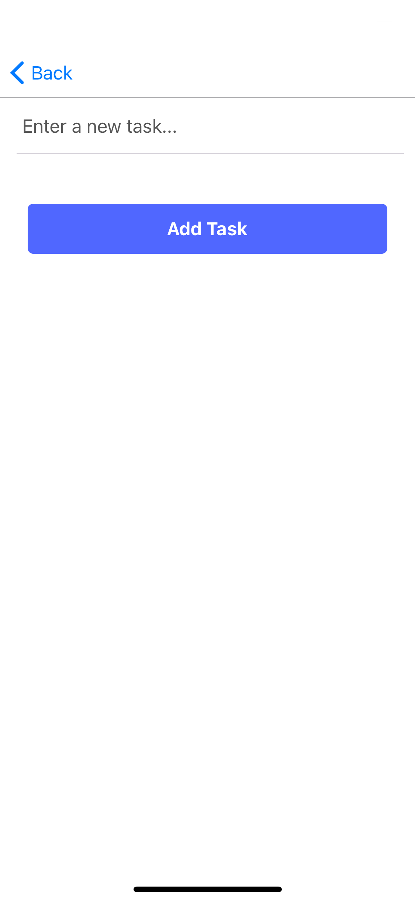

## Offline Todo List app

**[Here is the link to the Demo](https://github.com/amandeepmittal/offline-todolist-app)**

## Screens

- Addding a new item

  

- Categorize todo item whether it is pending or completed

  

- Modal screen to add a new item

  

## Tech Stack

- React Native
- Expo
- Native Base UI
- react-navigation (stack navigation)

## Installation

Clone or download the project repository, navigate inside the repo and then run the following command to install dependencies from a temrinal window

```shell
yarn add
```

After installing dependencies, run the command below to see the app in action.

```shell
expo start
```
